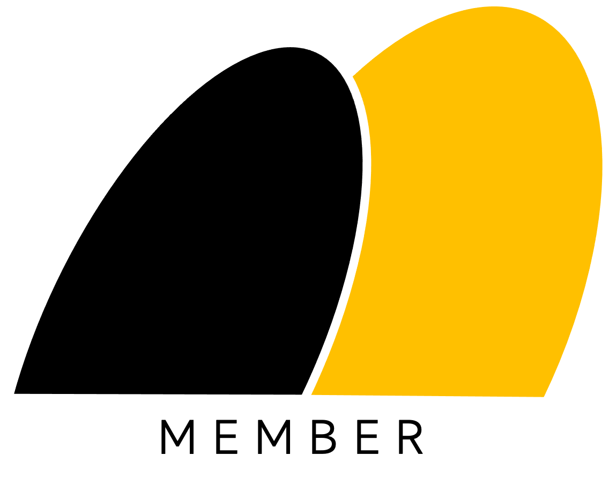
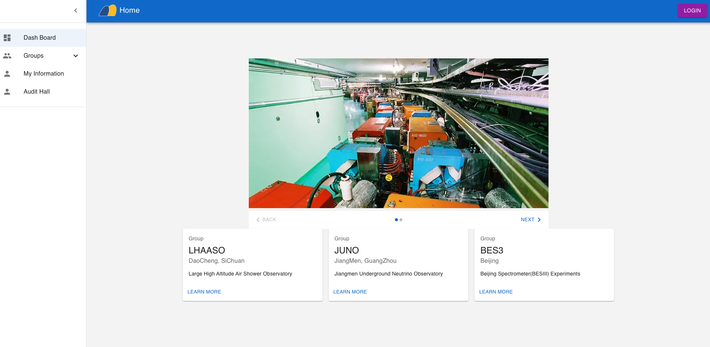
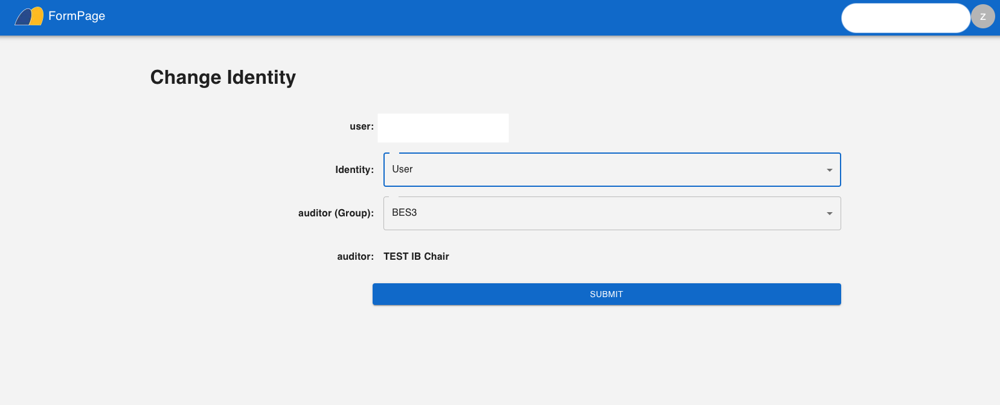
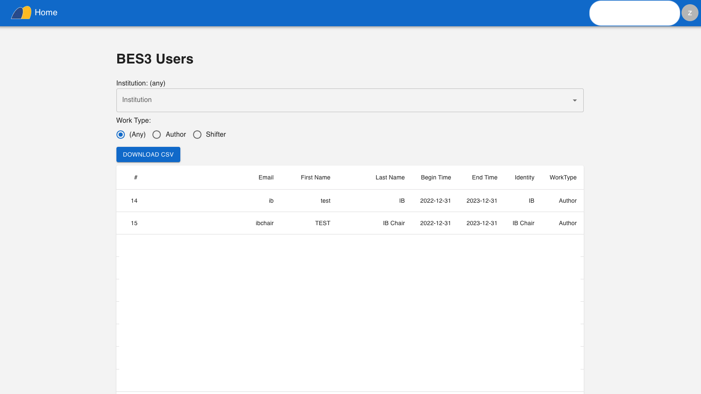

# Member OA

Member OA 是一个为物理合作组类似 BES3、LHAASO 等大型国际合作组提供成员管理功能的开源软件。

它包含用户管理、基金管理、单位管理、论文管理、会议管理等功能。

这个系统的前端使用 NextJS，UI 组件使用 Material UI。后端采用 Spring Boot。数据库采用 Mysql。安全组件使用 Apache Shiro。

## 安装

为了启动这个软件，你需要首先将 SQL 文件导入你的 Mysql，然后修改 backend 文件夹resource 文件中的 mysql 链接。然后启动 backend 和 frontend。
## 使用

在启动后，你可以使用浏览器访问 http://localhost:12306 来使用 Member OA。
## 开源协议

这个开源系统采用 BSD3 协议。你可以在遵守协议的前提下自由使用、复制、修改和分发这个软件。

# Member OA

Member OA is an open-source software that provides member management functions for large international cooperation groups in physics, such as BES3 and LHAASO. 

It includes functions such as user management, fund management, institution management, paper management, and conference management. 

The front-end of this system uses NextJS, and the front-end UI component uses Material UI. The back-end uses Spring Boot, the database uses Mysql, and the security component uses Apache Shiro.
## Installation

To start this system, you need to first import the SQL file into your Mysql, and then modify the mysql link in the backend folder resource file. Then start the backend and frontend.
## Usage

After starting, you can use a browser to access http://localhost:12306 to use Member OA.
## License

This open-source system is licensed under the BSD3 license. You are free to use, copy, modify and distribute this software under the terms of the license.